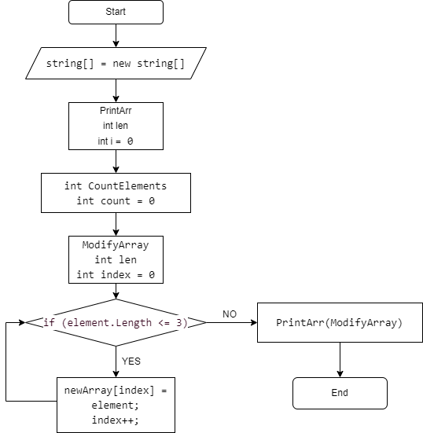

**Задача: Написать программу, которая из имеющегося массива строк формирует массив из строк, длина которых меньше либо равна 3 символа. Первоначальный массив можно ввести с клавиатуры, либо задать на старте выполнения алгоритма. При решении не рекомендуется пользоваться коллекциями, лучше обойтись исключительно массивами.**

# Описание решения

## Блок-схема алгоритма

1. Вводим заданный массив строк
2. Метод печати заданного массива 
3. Подсчет количества элементов в заданном массиве
4. Метод создания нового массив
5. Определям длину нового массива, которая меньше, либо равна 3 символам.
6. Заполняем новый массив
7. Печатаем новый массив